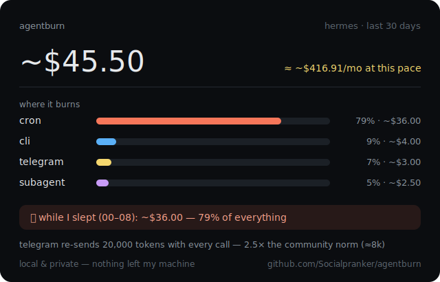

# agentburn

<p>
  <a href="https://pypi.org/project/agentburn/"></a>
  
  
  
  <a href="LICENSE"></a>
</p>

> **Where does your AI agent burn money — while you sleep?**

Always-on agents bill you around the clock. Hermes Agent users wake up to
[**$47 overnight bills**](https://dev.to/chintanonweb/hermes-agent-gets-smarter-every-day-so-does-the-bill-4i8o)
from recursive subagent runs; one user measured that
[**73% of every API call is fixed overhead**](https://github.com/NousResearch/hermes-agent/issues/4379)
(tool definitions + system prompt, resent every time); chained delegation means
*"step 3 costs 4× step 1 — no alert, just a bill."* Built-in `/usage` shows totals.
Nothing shows **where** it burns.

agentburn is a local profiler for your agent's own accounting data — **universal across agents**: Hermes Agent, OpenClaw and Claude Code today, one normalized model underneath. One command, zero dependencies, nothing leaves your machine:

```bash
uvx agentburn          # or: pipx run agentburn / pip install agentburn
```

```text
🔥 agentburn — hermes · last 30d

   TL;DR: ≈ ~$431/mo pace; 79% of it is `cron`.
   First fix: 79% of spend happens at night — route night work to a cheaper model

   ~$45.50 total · 1.75M tokens · 7 sessions · 123 API calls
   ≈ ~$431.24/month at the current pace

   WHERE IT BURNS (by source)
   cron                 ██████████████····  79%     ~$36.00    1.24M  2 sess
   cli                  ██················   9%      ~$4.00     185K  1 sess
   gateway:telegram     █·················   7%      ~$3.00     210K  1 sess
   subagent             █·················   5%      ~$2.50     113K  2 sess

   🌙 WHILE YOU SLEPT (00:00–08:00): ~$36.00 (79% of spend) · 2 sessions
      mostly: cron

   FIXED OVERHEAD (avg input tokens per API call)
   gateway:telegram       20,000 ← heavy
   cron                   15,000 ← heavy
      input composition (sampled from 3 request dumps): system 30% · tools 58% · history 12%

   💡 DO THIS
   1. 79% of spend happens at night — that's ≈$341/mo while you sleep. Route night work to a cheaper model.
   2. Scheduled (cron) sessions run on anthropic/claude-opus-x — maintenance rarely needs a frontier model.
   3. 20,000 input tokens per call on telegram: trim per-platform toolsets, prune unused skills.
```

## What it answers

- **Where it burns** — by source: `cron` / `subagent` / `gateway:telegram|discord|whatsapp` / `cli`. Always-on ≠ free: scheduled jobs and gateways spend without you.
- **🌙 While you slept** — the overnight bill, isolated and named (configurable window: `--night 23-7`).
- **Fixed overhead** — average input tokens per API call per source. The "73% overhead" pattern is visible in one glance; with request dumps enabled, you get the sampled composition (system prompt vs tool definitions vs history).
- **Subagent rollups** — delegation cost chained back to the session that spawned it. Recursion compounds; here is the receipt.
- **Top tools** — which tool results weigh most in your context.
- **What to do** — up to 4 conservative, named recommendations with monthly estimates.

## Why trust these numbers

Most token trackers quietly disagree with each other (2–91× in public issue threads). agentburn takes the opposite stance:

- Numbers come from **the agent's own accounting** (`~/.hermes/state.db`: per-session token counters and cost fields). No scraping, no proxies, no guessing.
- Provider-billed costs are shown as-is; Hermes estimates are marked with `~`. Mixed data is labeled mixed.
- Sessions with messages but **zero recorded tokens** (known Hermes accounting gaps, e.g. [#12023](https://github.com/NousResearch/hermes-agent/issues/12023)) are detected and reported: totals are then explicitly a **lower bound** — and fixing the accounting becomes recommendation #1.
- Input composition from request dumps is char-proportional and labeled *sampled estimate*, not truth.

## Privacy

Everything runs locally and reads your database **read-only**. No network calls. No telemetry. The report is yours.

## Usage

```bash
agentburn                        # every agent on this machine, last 30 days
agentburn --agent openclaw       # just one
agentburn --days 7
agentburn --agent hermes --db /path/to/state.db
agentburn why                    # behavioral forensics: loops, retry storms, idle heartbeats
agentburn why --source telegram  # decompose ONE source: functions called, errors, loops
agentburn --source cron          # cost report for one source only
agentburn explain --model llama3.1   # LLM reads the numbers back to you (local by default)
agentburn --night 23-7           # custom overnight window (local time)
agentburn --budget-month 50 --fail-over   # sentinel for cron/CI
agentburn --json                 # machine-readable, pipe it anywhere
agentburn --no-color
```

## Mechanics

**📤 Share your burn (`--share`).** An anonymized card — categories, models and totals only; session titles, paths and content are excluded *by construction*. Safe to paste into a post; `--svg card.svg` renders the same card as an image:

```text
🔥 my hermes agent · last 30d
~$45.50 → ~$430/mo pace · 1.75M tokens
where it burns: cron 79% · cli 9% · telegram 7% · subagent 5%
🌙 while I slept (00–08): ~$36.00 — 79% of everything
⚙️ telegram re-sends 20,000 tokens with EVERY call — 2.5× the community norm (≈8k)
— agentburn · local & private
```

`--svg card.svg` renders it as an image:



**📏 Calibration against public benchmarks.** "Is 15k input tokens per call normal?" The report compares your fixed overhead with community-measured references embedded as dated constants (e.g. the [Phala always-on-agent benchmark](https://phala.com/posts/understanding-openclaws-token-usage), 2026-03: ≈8k/call baseline). No network — sources are cited inline.

**📐 Optimize → prove it (`--save-baseline` / `--compare`).** Snapshot your pace, change the config (cheaper cron model, trimmed toolsets), then `agentburn --compare` shows the delta in $/month — pace-normalized, so a 7-day baseline compares honestly with a 30-day window. Every recommendation becomes a testable promise.

**🔬 `agentburn why` — behavioral forensics.** `report` says *where* it burns; `why` says *why*, from the agent's own recorded actions and thoughts:

```text
🔬 agentburn why — openclaw · gateway:telegram

   WHAT IT ACTUALLY DID   browser 34× ≈210K in results · web_search 18× · shell 7× (2 errors)
   RE-READ LOOPS          5× browser(https://news.site/page) — every repeat re-paid in full
   RETRY STORMS           Bash: 3 errors / 6 calls — paying full price for every error
   IDLE HEARTBEATS        4 of 9 heartbeat runs did NOTHING — $2.40 of pure idle burn
   BURNED ON FAILURES     2 failed runs → ~$3.90 (timeout, killed)
   THINKS MORE THAN IT WORKS   62% thinking · 84K tokens · "rename files task"

   💡 WHAT TO CHANGE
   1. `/proj/big.md` was fetched 4× in one session ≈32K tokens re-paid — cache it…
```

Observations with numbers, not verdicts; only tool names, truncated argument keys and counters — message content never leaves the machine (and never enters the report).

**🧠 `agentburn explain` — LLM interpretation, local-first.** The numbers, read back to you in plain language with ranked actions:

```bash
agentburn explain --model llama3.1                      # local ollama — nothing leaves the machine
agentburn explain --llm https://openrouter.ai/api/v1 \
  --model deepseek/deepseek-chat --yes-remote --lang ru # remote: explicit opt-in only
```

Privacy rules are hard-coded: the default endpoint is localhost (ollama / LM Studio); a remote endpoint requires `--yes-remote` and receives a **redacted** summary only — session titles become `session-N`, file paths shrink to basenames, message content is never in the payload to begin with. Works with any OpenAI-compatible API, zero new dependencies. (Yes — a cost profiler spending ~3K tokens to explain costs. The payload is compact and the answer capped; the irony is acknowledged.)

**🔧 `agentburn fix` — from findings to ready config patches (dry-run by design).** Not "consider a cheaper model" but the exact file and the exact lines:

```text
🔧 agentburn fix — hermes · DRY-RUN (nothing was changed)

   1. Point Hermes cron jobs at a cheap model
      file   : ~/.hermes/cron/jobs.json
      why    : cron is 79% of spend; maintenance rarely needs a frontier model.
      effect : bulk of ≈$341/mo moves to cheap-model pricing
      proposed:
        "nightly digest": "model": "deepseek/deepseek-chat"
      ⓘ field verified in hermes-agent cron/jobs.py: per-job `model` override
```

Patch generators exist only for config keys **verified against the agents' source code** (Hermes `cron/jobs.json`, OpenClaw `agents.defaults.heartbeat` incl. `activeHours` — the night-burn killer — and `lightContext`). There is no `--apply` on purpose: paste it yourself, then prove the saving with `--save-baseline` → `--compare`.

**🔌 `agentburn mcp` — your agent answers for its own bill.** A zero-dependency MCP stdio server exposing `burn_report` / `burn_why` / `burn_card`. Register it and ask the agent *"where do you burn my money?"* — it calls the profiler on its own database and explains:

```bash
# Claude Code
claude mcp add agentburn -- agentburn mcp
# Hermes / OpenClaw: add an stdio MCP server with command `agentburn mcp`
```

**🩺 `agentburn doctor`.** Trackers disagree because the agent's own accounting has gaps. doctor names the broken combinations (provider × model × source) for zero-usage and unpriced sessions, and generates a ready-to-paste upstream bug report — counters only, no message content.

**🚨 Sentinel mode — a budget guard for server agents.** Your agent runs 24/7 on a VPS; this watches it:

```bash
# alert when overnight burn exceeds $5/month pace (exit code 1 → any alerting hooks in)
agentburn --agent openclaw --budget-night 5 --fail-over --no-color \
  || notify-send "🚨 agent is burning money at night"
```

Drop it in cron next to the agent itself — the one-off check becomes a standing guard.

## Supported agents

One normalized model, one adapter per agent. Run `agentburn` and every agent found on the machine gets its own report.

| Agent | Status | Data source | Notes |
|---|---|---|---|
| **Hermes Agent** | ✅ | `~/.hermes/state.db` (+ optional request dumps) | costs from the agent's own accounting |
| **OpenClaw** | ✅ | `~/.openclaw/agents/*/sessions/sessions.json` | **heartbeat is its own category** — the famous one; cron / gateways / subagents split out |
| **Claude Code** | ✅ | `~/.claude/projects/**.jsonl` | tokens only, by design: CC doesn't record costs locally and subscription usage has no honest per-token price — we don't invent one |

Adapters are ~150 lines over a shared model. Codex CLI / opencode are natural next targets — PRs welcome.

## Related

[token-history](https://github.com/Socialpranker/token-history) — the macro view: daily archive of *which agents the world uses* (OpenRouter rankings). agentburn is the micro view: *where yours burns*.

## License

MIT
