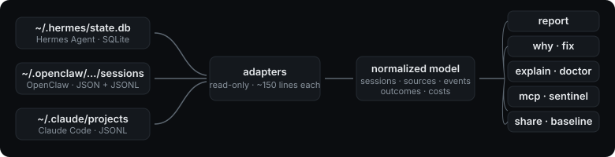
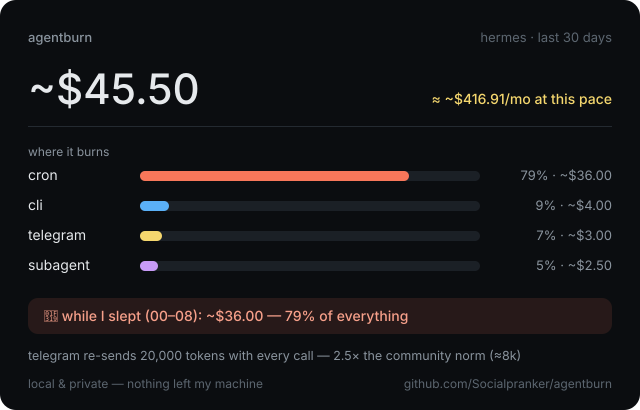

<div align="center">


<br>

<a href="https://pypi.org/project/agentburn/"></a>


<a href="../../actions/workflows/tests.yml"></a>
<a href="LICENSE"></a>

<br><br>


<br>

**[Claude Code](#supported-agents) · [OpenClaw](#supported-agents) · [Hermes Agent](#supported-agents)** — one normalized core, local, read-only, zero dependencies

```
uvx agentburn
```

**[▶ &nbsp;Try it in your browser — no install](https://socialpranker.github.io/agentburn/)**

</div>

---

## You didn't run out on your average day

You ran out inside **one window**. On this machine that window was **5.4× the median one** — same person, same week, same subscription.

Your assistant's own logs already know which window it was and what filled it. Nothing else on your machine does: the built-in counter shows a total, your invoice shows a total, and neither says *which five hours took you out.*

```
⏳ agentburn limits — claude-code · rolling 5-hour windows

   PEAK WINDOW        Aug 04 12:45–17:45 · 555M weighted
                      opus 91% · sonnet 9%   ·   cli 93% · subagent 7%
   TYPICAL WINDOW     104M    median of 83 active 5h slots
   PEAK / TYPICAL     5.4×    a wall is hit by the peak, not by the median

   WHAT FILLS THE WINDOW
   cache reads     64%   ·   cache writes 25%   ·   output 11%
```

One command, no account, nothing leaves your computer:

```bash
uvx agentburn            # where it burns, and what to change
uvx agentburn limits     # how fast you fill a usage window
```

## Two ways agents cost you, two questions

| If you pay… | what actually runs out | ask |
|---|---|---|
| **a subscription** (Claude Code Pro/Max) | the rolling usage **window** — the invoice is fixed, the wall is not | `agentburn limits` |
| **per token** (API keys, OpenClaw, Hermes) | **money**, mostly while you're asleep | `agentburn` |

Both read the same local logs. Neither invents a number the data doesn't contain.


### `agentburn limits` — the subscription view

Optimizing a subscription doesn't change your bill. It changes how far you get before you're cut off. That is a *window* problem, and windows need intra-session resolution — a single session routinely spans several of them.

- **Peak vs typical.** Your worst rolling 5-hour window against the median of your own active ones. The ratio is the finding: a wall is hit by the peak.
- **What filled it** — by model, by source (you / subagents / scheduled work), and by kind (cache reads vs cache writes vs output).
- **Measured against your own wall.** Anthropic doesn't publish the formula behind those allowances, so agentburn refuses to invent a threshold. Tell it when you were actually cut off and the arithmetic becomes yours:

  ```bash
  agentburn limits --hit "2026-08-20 14:30"
  #   ceiling         38.4M weighted tokens   ← measured from your own cut-off
  #   peak window       107% of your ceiling
  #   last 5h            12% of your ceiling
  ```

Weighted tokens = tokens × *published* price ratios (cache read 0.1×, cache write 1.25×, output per model), normalized to one input token of the reference model. Every ratio is public; none of them is a guess about how the provider counts.

### `agentburn` — the money view

- **Where it burns** — by source: `cron` / `subagent` / `gateway:telegram|discord|whatsapp` / `cli`. Always-on ≠ free.
- **🌙 While you slept** — the overnight bill, isolated and named (`--night 23-7`).
- **Fixed overhead** — uncached input tokens per API call, per source, calibrated against a public benchmark.
- **Subagent rollups** — delegation cost chained back to the session that spawned it.
- **`agentburn why`** — behavioral forensics: re-read loops, retry storms, idle heartbeats, per-cron receipts, context thrash.
- **`agentburn fix`** — ready-to-paste config patches, dry-run by design.

## `agentburn fix` — findings become config, not advice

Not "consider a cheaper model" but the exact file and the exact lines. Patch generators exist **only** for levers verified against the agent's own source or documented configuration:

```text
🔧 agentburn fix — claude-code · DRY-RUN (nothing was changed)

   1. Drop 2 MCP server(s) you never called
      why    : registered but not called once in the last 30d: blender-mcp, pixellab.
               Every registered server ships its tool definitions with the context
               of every session that loads it.
      proposed:
        claude mcp remove blender-mcp

   2. Trim the always-loaded memory files (2,254 tokens)
      why    : loaded into every session's context and re-sent whenever the prompt
               cache expires or the context is compacted — at least 3,565× this window.
```

| Agent | Verified levers |
|---|---|
| Claude Code | registered MCP servers (`~/.claude.json`, `.mcp.json`), always-loaded `CLAUDE.md` memory files |
| Hermes | per-job `model` / `enabled_toolsets` (`cron/jobs.py`), per-platform toolsets (`gateway/run.py`) |
| OpenClaw | `heartbeat.{every, activeHours, model, lightContext}` (`config/types.agent-defaults.ts`) |

There is no `--apply` on purpose: it's your agent's config. Paste it yourself, then prove the saving with `--save-baseline` → `--compare`.

## Why trust these numbers

Token trackers quietly disagree with each other (2–91× in public issue threads). agentburn takes the opposite stance:

- Numbers come from **the agent's own accounting**, read-only. No scraping, no proxies, no guessing.
- Provider-billed costs are shown as-is; estimates are marked `~`; mixed data is labeled mixed.
- **Where a price doesn't exist, none is invented.** Claude Code records no costs and subscription usage has no honest per-token price — so that adapter reports tokens and windows, never dollars.
- Sessions with messages but **zero recorded tokens** (known accounting gaps, e.g. [hermes-agent #12023](https://github.com/NousResearch/hermes-agent/issues/12023)) are detected: totals become an explicit **lower bound**, and fixing the accounting becomes recommendation #1.
- Result weights on agents that don't record them are labeled *estimates*, and only ever used to rank findings against each other.

## Privacy

Everything runs locally and reads your logs **read-only**. No network calls, no telemetry, no accounts. The report is yours. The only commands that touch the network say so: `drift` GETs a public trends file, `--submit` opens a prefilled issue *you* review and send.

## Why this exists

Always-on agents bill you around the clock — and their built-in counters only show totals:

> *"73% of every API call is fixed overhead — ~13.9K tokens of tool definitions and system prompt, resent every time."* — [hermes-agent #4379](https://github.com/NousResearch/hermes-agent/issues/4379)

> *"One entrant wrote about waking up to a **$47 surprise bill** from an overnight run — that's not an exotic failure, it's the default behavior of an unsupervised loop."* — [dev.to](https://dev.to/chintanonweb/hermes-agent-gets-smarter-every-day-so-does-the-bill-4i8o)

## How it compares

|  | **agentburn** | ccusage | codeburn | built-in `/usage` |
|---|---|---|---|---|
| Usage **windows** (peak vs typical, what filled them) | ✅ | — | — | current window only |
| Burn by *source* (cron · heartbeat · gateways · subagents) | ✅ | — | — | % only, 7 days |
| 🌙 the overnight bill, isolated | ✅ | — | — | — |
| Behavioral forensics (`why`: loops, retry storms, failed-run cost) | ✅ | — | — | — |
| Ready config patches (`fix`, verified levers) | ✅ | — | — | — |
| MCP server (the agent answers for its own bill) | ✅ | — | — | — |
| Totals / live blocks / many CLIs | basic | ✅ best-in-class | ✅ TUI, 25 providers | totals |

*ccusage and codeburn are excellent at what they do — agentburn deliberately starts where they stop ([ccusage scoped per-tool analysis out](https://github.com/ryoppippi/ccusage/issues/688)).*

## Supported agents

One normalized model, one adapter per agent. Run `agentburn` and every agent found on the machine gets its own report.

| Agent | Status | Data source | Notes |
|---|---|---|---|
| **Claude Code** | ✅ | `~/.claude/projects/**.jsonl` | tokens and **windows**, by design: no local costs, no honest per-token price for a subscription |
| **OpenClaw** | ✅ | `~/.openclaw/agents/*/sessions/sessions.json` | **heartbeat is its own category** — the famous one |
| **Hermes Agent** | ✅ | `~/.hermes/state.db` (+ optional request dumps) | costs from the agent's own accounting |

Adapters are ~150 lines over a shared model. Codex CLI / opencode are natural next targets — PRs welcome.

<div align="center"></div>

## Everything else

<details>
<summary><b>🔌 <code>agentburn mcp</code> — your agent answers for its own bill</b></summary>

A zero-dependency MCP stdio server exposing `burn_report` / `burn_limits` / `burn_why` / `burn_card`. Register it and ask *"where do you burn my money?"* — it profiles its own database and explains.

```bash
claude mcp add agentburn -- agentburn mcp
# Hermes / OpenClaw: add an stdio MCP server with command `agentburn mcp`
```

Prefer skills? There's a ready [`SKILL.md`](skill/README.md) for `~/.claude/skills/agentburn/` (or the Hermes/OpenClaw equivalents).
</details>

<details>
<summary><b>📤 <code>--share</code> — an anonymized card, safe to post</b></summary>

Categories, models and totals only; session titles, paths and content are excluded *by construction*. `--svg card.svg` renders the same card as an image.

```text
🔥 my claude-code agent · last 30d
3.01B tokens · 19,255 API calls
where it burns: cli 77% · subagent 23%
⏳ my peak 5h window: 555M weighted tokens — 5.4× my own median window
🌙 while I slept (00–08): 75.3M tokens — 3% of everything
— agentburn · local & private
```


</details>

<details>
<summary><b>📐 <code>--save-baseline</code> / <code>--compare</code> — prove the saving</b></summary>

Snapshot your pace, change the config, then `agentburn --compare` shows the delta — pace-normalized, so a 7-day baseline compares honestly with a 30-day window. Every recommendation becomes a testable promise.
</details>

<details>
<summary><b>🧭 <code>agentburn drift</code> — your spend × the world's direction</b></summary>

Are you paying for a model the world is leaving? Your side is computed locally; the world side is one read-only GET of [token-history](https://github.com/Socialpranker/token-history)'s public trend JSON (archived daily from OpenRouter's rankings). Nothing about you is sent anywhere; `--trends FILE` works fully offline.
</details>

<details>
<summary><b>🧠 <code>agentburn explain</code> — LLM interpretation, local-first</b></summary>

```bash
agentburn explain --model llama3.1          # local ollama — nothing leaves the machine
agentburn explain --llm https://openrouter.ai/api/v1 \
  --model deepseek/deepseek-chat --yes-remote --lang ru
```

The default endpoint is localhost; a remote one requires `--yes-remote` and receives a **redacted** summary (titles → `session-N`, paths → basenames, content never present to begin with).
</details>

<details>
<summary><b>🩺 <code>agentburn doctor</code> + 🚨 sentinel mode</b></summary>

`doctor` names the broken combinations (provider × model × source) behind zero-usage and unpriced sessions, and generates a ready-to-paste upstream bug report — counters only.

Sentinel mode is a budget guard for server agents:

```bash
agentburn --agent openclaw --budget-night 5 --fail-over --no-color \
  || notify-send "🚨 agent is burning money at night"
```
</details>

<details>
<summary><b>📊 <code>agentburn rank</code> — the Burn Index (community percentiles)</b></summary>

Anonymous percentiles of *efficiency* — the benchmark volume-leaderboards can't be: nothing here rewards burning more. Joining is consent-by-click: `agentburn --submit` prints the exact anonymized payload (ratios and a coarse spend band — never raw volumes, titles or paths), then a prefilled GitHub-issue link that **you** open and submit. Percentiles need 5+ setups per metric before they mean anything.
</details>

## Related

[token-history](https://github.com/Socialpranker/token-history) — the macro view: daily archive of *which agents the world uses*. agentburn is the micro view: *where yours burns*.

## License

MIT

<sub>mcp-name: io.github.Socialpranker/agentburn</sub>

---

<div align="center">

**the token-\* family** · [token-history](https://github.com/Socialpranker/token-history) — which agents the world runs · **agentburn** — where yours burns

*if this saved you a window's worth of work, a ⭐ helps the next person find it*

</div>
